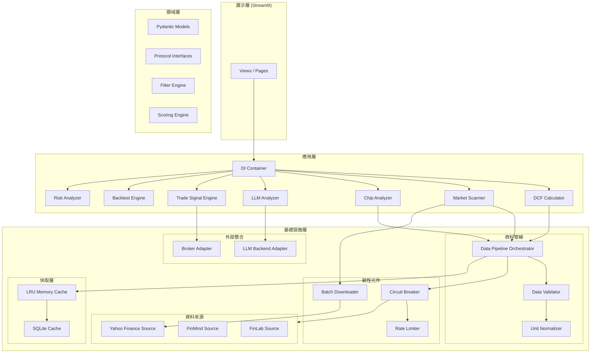
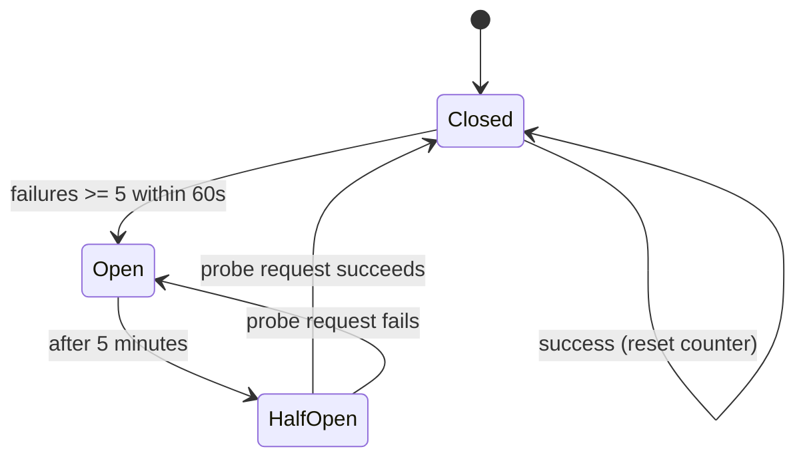
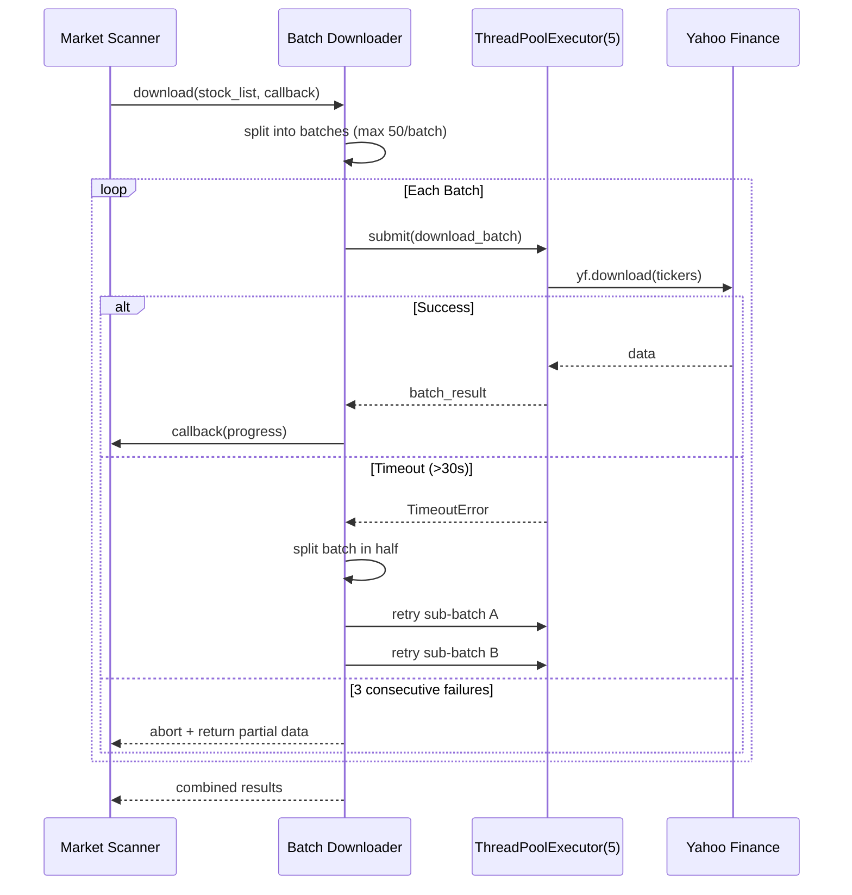
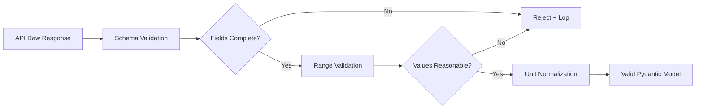
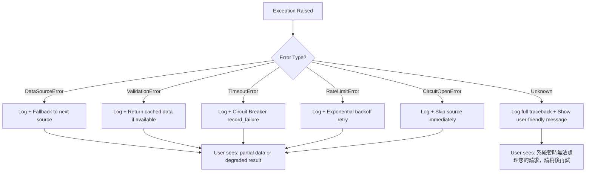

# Design Document: Stock Valuation Optimization

## 概覽

本設計文件定義台股估值工具 v3.0 的全面性架構重構方案，涵蓋依賴注入、效能最佳化、資料管線韌性、新功能模組、以及品質保障體系。設計目標為將現有原型級應用提升至生產級水準，同時確保向下相容性。

### 設計原則

1. **介面導向**：所有模組依賴抽象介面（Protocol），而非具體實作
2. **韌性優先**：外部 API 失敗時系統應優雅降級而非崩潰
3. **可測試性**：核心邏輯與 I/O 分離，支援完整的單元測試與屬性基測試
4. **漸進遷移**：新架構可逐步導入，不需一次性重寫所有模組

---

## 架構

### 高層架構圖



### 分層職責

| 層級 | 職責 | 依賴方向 |
|------|------|----------|
| 展示層 | Streamlit UI 渲染、使用者互動 | → 應用層 |
| 應用層 | 業務邏輯編排、用例協調 | → 領域層 |
| 領域層 | 資料模型、介面定義、純計算邏輯 | 無外部依賴 |
| 基礎設施層 | 外部 API、資料庫、快取、網路 | → 領域層（實作介面） |

### 目標目錄結構

```
stock-valuation-tool/
├── app/
│   ├── main.py                    # Streamlit 入口
│   ├── container.py               # DI Container 設定
│   ├── core/                      # 領域層
│   │   ├── models/                # Pydantic 資料模型
│   │   │   ├── stock.py           # StockInfo, PriceData
│   │   │   ├── financial.py       # FinancialData, DCFResult
│   │   │   ├── scan.py            # ScanResult, MarketSnapshot
│   │   │   └── trade.py           # TradeSignal
│   │   ├── protocols.py           # Protocol 介面定義
│   │   └── errors.py              # 自訂例外類別階層
│   ├── services/                   # 應用層
│   │   ├── dcf_calculator.py      # DCF 估值引擎
│   │   ├── market_scanner.py      # 市場掃描器
│   │   ├── chip_analyzer.py       # 籌碼分析器
│   │   ├── llm_analyzer.py        # LLM 分析器
│   │   ├── trade_engine.py        # 交易訊號引擎
│   │   ├── backtest.py            # 回測引擎
│   │   ├── risk_analysis.py       # 風險分析
│   │   └── filters/               # 篩選邏輯（從 scanner 拆出）
│   │       ├── fundamental.py
│   │       ├── technical.py
│   │       └── chip.py
│   ├── infra/                      # 基礎設施層
│   │   ├── data_pipeline.py       # 資料管線協調器
│   │   ├── sources/               # 資料來源
│   │   │   ├── base.py
│   │   │   ├── yfinance_source.py
│   │   │   ├── finmind_source.py
│   │   │   └── finlab_source.py
│   │   ├── resilience/            # 韌性元件
│   │   │   ├── circuit_breaker.py
│   │   │   ├── rate_limiter.py
│   │   │   └── batch_downloader.py
│   │   ├── cache/                 # 快取層
│   │   │   ├── memory_cache.py    # LRU + TTL
│   │   │   └── sqlite_cache.py
│   │   ├── logging.py             # 結構化日誌
│   │   └── error_handler.py       # 統一錯誤處理
│   └── views/                      # 展示層
│       ├── dcf_valuation.py
│       ├── market_screener.py
│       ├── chip_analysis.py
│       ├── llm_report.py
│       └── ...
├── tests/
│   ├── unit/
│   ├── property/                  # Hypothesis 屬性基測試
│   └── integration/
└── pyproject.toml
```

---

## 元件與介面

### 1. DI Container（依賴注入容器）

**設計決策**：使用輕量級自製 DI Container（基於 dict 註冊表），而非引入 `dependency-injector` 等第三方套件。原因：本專案規模適中，Protocol + 簡單工廠模式已足夠，避免學習曲線與過度抽象。

```python
from typing import Protocol, Type, TypeVar, Callable, Dict, Any
from enum import Enum

class Lifetime(Enum):
    SINGLETON = "singleton"
    TRANSIENT = "transient"

class Container:
    """輕量級 DI 容器"""
    
    def __init__(self) -> None:
        self._registry: Dict[Type, tuple[Callable, Lifetime]] = {}
        self._singletons: Dict[Type, Any] = {}
    
    def register(
        self, 
        interface: Type, 
        factory: Callable, 
        lifetime: Lifetime = Lifetime.SINGLETON
    ) -> None:
        """註冊服務"""
        self._registry[interface] = (factory, lifetime)
    
    def resolve(self, interface: Type) -> Any:
        """解析服務實例"""
        if interface not in self._registry:
            raise KeyError(f"Service not registered: {interface}")
        factory, lifetime = self._registry[interface]
        if lifetime == Lifetime.SINGLETON:
            if interface not in self._singletons:
                self._singletons[interface] = factory()
            return self._singletons[interface]
        return factory()
    
    def override(self, interface: Type, instance: Any) -> None:
        """覆寫為測試用 mock（測試專用）"""
        self._singletons[interface] = instance
```

### 2. Protocol 介面定義

```python
from typing import Protocol, Optional, Dict, Any, List
from datetime import datetime
import pandas as pd

class DataSourceProtocol(Protocol):
    """資料來源抽象介面"""
    @property
    def source_name(self) -> str: ...
    @property
    def is_available(self) -> bool: ...
    def is_ready(self) -> bool: ...
    def get_stock_price(
        self, stock_code: str, start_date: datetime, end_date: datetime
    ) -> Optional[pd.DataFrame]: ...
    def get_financial_data(
        self, stock_code: str, years: int = 5
    ) -> Optional[pd.DataFrame]: ...
    def get_stock_info(self, stock_code: str) -> Optional[Dict[str, Any]]: ...

class CacheProtocol(Protocol):
    """快取層抽象介面"""
    def get(self, key: str) -> Optional[Any]: ...
    def set(self, key: str, value: Any, ttl: Optional[int] = None) -> None: ...
    def delete(self, key: str) -> None: ...
    def invalidate_prefix(self, prefix: str) -> int: ...
    def stats(self) -> Dict[str, int]: ...

class CircuitBreakerProtocol(Protocol):
    """斷路器抽象介面"""
    @property
    def state(self) -> str: ...  # "closed", "open", "half_open"
    def record_success(self) -> None: ...
    def record_failure(self) -> None: ...
    def allow_request(self) -> bool: ...
    def reset(self) -> None: ...

class LLMBackendProtocol(Protocol):
    """LLM 後端抽象介面"""
    def generate(self, prompt: str, max_tokens: int = 2000) -> str: ...

class BrokerAdapterProtocol(Protocol):
    """券商 API 抽象介面"""
    def query_balance(self) -> Dict[str, float]: ...
    def place_order(
        self, stock_code: str, action: str, quantity: int, price: float
    ) -> Dict[str, Any]: ...
    def cancel_order(self, order_id: str) -> bool: ...
```

### 3. Circuit Breaker（斷路器）

**設計決策**：自製狀態機實作，不引入 `pybreaker` 等套件。原因：需求明確（5 failures/60s → open, 5min → half-open），自製可精確控制時間視窗行為並方便單元測試。



**關鍵實作細節**：
- 使用滑動時間視窗（deque + timestamp）追蹤 60 秒內的失敗次數
- 每個外部資料來源（Yahoo Finance、FinMind、FinLab）各自獨立的 CircuitBreaker 實例
- 半開狀態僅允許 1 次試探性請求
- 所有時間相關操作接受可注入的 `time_func` 參數以利測試

### 4. Rate Limiter（速率限制器）

**設計決策**：Token Bucket 演算法 + FinMind 配額預檢。

```python
class RateLimiter:
    """Token Bucket 速率限制器"""
    
    def __init__(
        self,
        max_tokens: int = 10,
        refill_rate: float = 1.0,  # tokens/second
        time_func: Callable[[], float] = time.time
    ) -> None: ...
    
    def acquire(self, tokens: int = 1) -> bool:
        """嘗試取得 token，成功回傳 True"""
        ...
    
    async def wait_and_acquire(self, tokens: int = 1) -> None:
        """等待直到 token 可用"""
        ...
```

**FinMind 專用行為**：
- 每次批次請求前呼叫 `user_info` 端點確認剩餘配額
- 配額 < 120% 預計請求量 → 降速至 1 req/s
- HTTP 402 → 記錄事件 + 觸發 Circuit Breaker + 切換備援
- 重試策略：指數退避 1s → 2s → 4s（最大 60s，最多 3 次）

### 5. Batch Downloader（批次下載器）

**設計決策**：使用 `concurrent.futures.ThreadPoolExecutor`（max_workers=5）搭配分批策略。選擇 ThreadPoolExecutor 而非 asyncio 的原因：yfinance 為同步 API，改 async 需重寫整個 I/O 層，ThreadPool 可直接包裹現有呼叫。



**關鍵參數**：
- 批次大小：50 檔
- 批次間等待：1 秒
- 單批逾時：30 秒
- 最大並行度：5 workers
- 連續失敗上限：3 批次

### 6. LRU Memory Cache

**設計決策**：使用 `collections.OrderedDict` 實作 LRU，搭配 per-type TTL 配置。不使用 `functools.lru_cache` 的原因：需要 per-key TTL、手動失效（invalidation）、以及統計功能。

```python
from dataclasses import dataclass
from enum import Enum

class CacheEntryType(Enum):
    PRICE = "price"          # TTL: 5 minutes
    FINANCIAL = "financial"  # TTL: 1 hour
    COMPANY = "company"      # TTL: 24 hours
    CHIP = "chip"            # TTL: 4 hours

TTL_CONFIG: Dict[CacheEntryType, int] = {
    CacheEntryType.PRICE: 300,
    CacheEntryType.FINANCIAL: 3600,
    CacheEntryType.COMPANY: 86400,
    CacheEntryType.CHIP: 14400,
}

@dataclass
class CacheEntry:
    value: Any
    entry_type: CacheEntryType
    created_at: float
    
    @property
    def is_expired(self) -> bool:
        ttl = TTL_CONFIG[self.entry_type]
        return (time.time() - self.created_at) > ttl
```

**關鍵行為**：
- 容量上限 200 筆，滿時驅逐 LRU 條目
- 取值時回傳淺複製（`copy.copy()`），防止外部修改汙染快取
- 支援 `invalidate_by_stock(stock_code)` 清除特定股票的所有條目
- 提供 `stats()` 回傳命中/未命中/驅逐次數

### 7. Data Validation Layer（資料驗證層）

**設計決策**：使用 Pydantic v2 的 `field_validator` 與 `model_validator` 實作多層次驗證。

**驗證流程**：


**單位歸一化規則**（在 Pydantic validator 中實作）：
- ROE：若輸入值 < 1.0 → 視為小數形式 → 乘以 100 轉為百分比
- 殖利率：同上
- 市值：若 > 1e8 → 視為「元」單位 → 除以 1e8 轉為「億」

### 8. Chip Analyzer（籌碼分析器）

**設計決策**：獨立模組，透過 FinMind API 取得法人買賣超資料，結果快取至 SQLite。

**資料來源**：
- FinMind `TaiwanStockInstitutionalInvestorsBuySell`（三大法人買賣超）
- 計算衍生指標：連續買超天數、持股比例變化（5/20/60日）

**整合方式**：
- Market Scanner 的篩選器新增 `ChipFilter` 類別
- ChipFilter 支援：外資連續買超天數、投信連續買超天數、合計買超張數
- 資料取得失敗時，篩選結果中標示「籌碼資料不可用」（保留欄位，顯示 N/A）

### 9. LLM Analyzer（LLM 分析器）

**設計決策**：抽象 LLM 後端為 Protocol，搭配 rule-based fallback 確保可用性。

**報告結構**：
```python
@dataclass
class AnalysisReport:
    summary: str          # 投資摘要（≤100字）
    health_score: int     # 財務體質評分（1-10）
    risk_factors: List[str]
    recommendation: str   # 建議操作
    data_sources: List[DataSourceRef]
    generated_at: datetime
```

**降級策略**：
1. 嘗試主要 LLM 後端（透過 DI 注入）
2. 逾時 30 秒或 API 錯誤 → 切換至 rule-based 分析
3. Rule-based 分析根據 DCF upside、ROE、PE ratio 產出固定模板報告

### 10. Trade Signal Engine（交易訊號引擎）

**設計決策**：事件驅動架構，訊號持久化至 SQLite 供外部消費。

**訊號產生條件**：
- 買入條件：DCF 低估 > 30% AND 法人連續買超 > 3 日
- 賣出條件：DCF 高估 > 20% OR 法人連續賣超 > 5 日

**Paper Trading 模式**：
- 記錄虛擬交易至 `paper_trades` 資料表
- 追蹤每筆交易的進場/出場價格與持有期間報酬率
- 提供績效摘要（勝率、平均報酬、最大回撤）

---

## 資料模型

### Pydantic 核心模型定義

```python
from pydantic import BaseModel, Field, field_validator, model_validator
from typing import Optional, List, Dict, Any
from datetime import datetime, date
from enum import Enum
import pandas as pd
import json

class Market(str, Enum):
    """市場別"""
    TW = "TW"       # 台灣上市
    TWO = "TWO"     # 台灣上櫃
    US = "US"       # 美國市場

class StockInfo(BaseModel):
    """股票基本資訊"""
    stock_code: str = Field(..., description="股票代碼")
    stock_name: str = Field("", description="股票名稱")
    market: Market = Field(Market.TW, description="市場別")
    industry: str = Field("", description="產業類別")
    listed_date: Optional[date] = Field(None, description="上市日期")
    shares_outstanding: Optional[int] = Field(None, ge=0, description="流通股數")
    
    @field_validator("stock_code")
    @classmethod
    def validate_stock_code(cls, v: str) -> str:
        v = v.strip()
        if not v:
            raise ValueError("股票代碼不得為空")
        return v
    
    def to_json(self) -> str:
        return self.model_dump_json()
    
    @classmethod
    def from_json(cls, json_str: str) -> "StockInfo":
        return cls.model_validate_json(json_str)
    
    def to_dataframe(self) -> pd.DataFrame:
        return pd.DataFrame([self.model_dump()])
    
    @classmethod
    def from_dataframe(cls, df: pd.DataFrame) -> "StockInfo":
        return cls.model_validate(df.iloc[0].to_dict())


class PriceData(BaseModel):
    """股價資料"""
    stock_code: str
    date: date
    open_price: float = Field(..., gt=0, description="開盤價")
    high_price: float = Field(..., gt=0, description="最高價")
    low_price: float = Field(..., gt=0, description="最低價")
    close_price: float = Field(..., gt=0, description="收盤價")
    volume: int = Field(..., ge=0, description="成交量（股）")
    
    @model_validator(mode="after")
    def validate_price_consistency(self) -> "PriceData":
        if self.high_price < self.low_price:
            raise ValueError("最高價不得低於最低價")
        if self.close_price > self.high_price or self.close_price < self.low_price:
            raise ValueError("收盤價須在最高最低價之間")
        return self
    
    def to_json(self) -> str:
        return self.model_dump_json()
    
    @classmethod
    def from_json(cls, json_str: str) -> "PriceData":
        return cls.model_validate_json(json_str)


class FinancialData(BaseModel):
    """財報資料"""
    stock_code: str
    period: str = Field(..., description="期間，如 2024Q4")
    revenue: float = Field(..., ge=0, description="營收（百萬）")
    eps: float = Field(..., ge=-1000, le=10000, description="每股盈餘")
    roe: float = Field(..., ge=-100, le=200, description="股東權益報酬率（%）")
    pe_ratio: Optional[float] = Field(None, ge=-100, le=10000, description="本益比")
    dividend_yield: Optional[float] = Field(None, ge=0, le=100, description="殖利率（%）")
    operating_margin: Optional[float] = Field(None, ge=-100, le=100, description="營業利益率（%）")
    
    @field_validator("roe", "dividend_yield", mode="before")
    @classmethod
    def normalize_percentage(cls, v: Optional[float]) -> Optional[float]:
        """自動將小數形式轉為百分比形式"""
        if v is not None and -1.0 < v < 1.0 and v != 0:
            return v * 100
        return v
    
    def to_json(self) -> str:
        return self.model_dump_json()
    
    @classmethod
    def from_json(cls, json_str: str) -> "FinancialData":
        return cls.model_validate_json(json_str)
```

```python
class DCFResult(BaseModel):
    """DCF 估值結果"""
    stock_code: str
    stock_name: str = ""
    current_price: float = Field(..., gt=0, description="目前股價")
    intrinsic_value: float = Field(..., description="內在價值")
    upside_potential: float = Field(..., ge=-1.0, le=100.0, description="潛在獲利率")
    discount_rate: float = Field(..., gt=0, le=1.0, description="折現率")
    growth_rates: List[float] = Field(..., description="成長率 [1-5年, 6-10年]")
    terminal_value: float = Field(..., description="終值")
    recommendation: str = Field("", description="投資建議")
    calculated_at: datetime = Field(default_factory=datetime.now)
    data_source: str = Field("", description="資料來源")
    
    def to_json(self) -> str:
        return self.model_dump_json()
    
    @classmethod
    def from_json(cls, json_str: str) -> "DCFResult":
        return cls.model_validate_json(json_str)
    
    def to_dataframe(self) -> pd.DataFrame:
        return pd.DataFrame([self.model_dump()])
    
    @classmethod
    def from_dataframe(cls, df: pd.DataFrame) -> "DCFResult":
        return cls.model_validate(df.iloc[0].to_dict())


class ScanResult(BaseModel):
    """市場掃描結果"""
    stock_code: str
    stock_name: str = ""
    current_price: float = Field(0, ge=0)
    pe_ratio: float = Field(0, ge=-100, le=10000)
    roe: float = Field(0, ge=-100, le=200)
    dividend_yield: float = Field(0, ge=0, le=100)
    market_cap: float = Field(0, ge=0, description="市值（億）")
    price_position: float = Field(0, ge=0, le=1.0, description="52週位階")
    fundamental_score: float = Field(0, ge=0, le=100)
    fundamental_grade: str = ""
    chip_data_available: bool = True
    foreign_consecutive_buy: Optional[int] = None
    trust_consecutive_buy: Optional[int] = None
    
    @field_validator("roe", "dividend_yield", mode="before")
    @classmethod
    def normalize_percentage(cls, v: Optional[float]) -> Optional[float]:
        if v is not None and -1.0 < v < 1.0 and v != 0:
            return v * 100
        return v
    
    def to_json(self) -> str:
        return self.model_dump_json()
    
    @classmethod
    def from_json(cls, json_str: str) -> "ScanResult":
        return cls.model_validate_json(json_str)


class SignalType(str, Enum):
    BUY = "buy"
    SELL = "sell"
    HOLD = "hold"

class TradeSignal(BaseModel):
    """交易訊號"""
    stock_code: str
    signal_type: SignalType
    confidence: int = Field(..., ge=0, le=100, description="信心度")
    trigger_description: str = Field(..., description="觸發條件描述")
    suggested_price_low: float = Field(..., gt=0, description="建議價格下限")
    suggested_price_high: float = Field(..., gt=0, description="建議價格上限")
    generated_at: datetime = Field(default_factory=datetime.now)
    
    @model_validator(mode="after")
    def validate_price_range(self) -> "TradeSignal":
        if self.suggested_price_high < self.suggested_price_low:
            raise ValueError("價格上限不得低於下限")
        return self
    
    def to_json(self) -> str:
        return self.model_dump_json()
    
    @classmethod
    def from_json(cls, json_str: str) -> "TradeSignal":
        return cls.model_validate_json(json_str)
```

### SQLite Schema 擴展

```sql
-- 新增：籌碼資料表
CREATE TABLE IF NOT EXISTS chip_data (
    stock_code TEXT NOT NULL,
    trade_date TEXT NOT NULL,
    foreign_buy INTEGER DEFAULT 0,
    foreign_sell INTEGER DEFAULT 0,
    trust_buy INTEGER DEFAULT 0,
    trust_sell INTEGER DEFAULT 0,
    dealer_buy INTEGER DEFAULT 0,
    dealer_sell INTEGER DEFAULT 0,
    last_updated TEXT NOT NULL,
    PRIMARY KEY (stock_code, trade_date)
);

CREATE INDEX idx_chip_stock_date ON chip_data(stock_code, trade_date DESC);

-- 新增：交易訊號佇列
CREATE TABLE IF NOT EXISTS trade_signals (
    id INTEGER PRIMARY KEY AUTOINCREMENT,
    stock_code TEXT NOT NULL,
    signal_type TEXT NOT NULL,  -- buy/sell/hold
    confidence INTEGER NOT NULL,
    trigger_description TEXT,
    suggested_price_low REAL,
    suggested_price_high REAL,
    generated_at TEXT NOT NULL,
    consumed_at TEXT,           -- 被外部系統消費的時間
    status TEXT DEFAULT 'pending'  -- pending/consumed/expired
);

CREATE INDEX idx_signals_status ON trade_signals(status, generated_at DESC);
CREATE INDEX idx_signals_stock ON trade_signals(stock_code, generated_at DESC);

-- 新增：Paper Trading 記錄
CREATE TABLE IF NOT EXISTS paper_trades (
    id INTEGER PRIMARY KEY AUTOINCREMENT,
    stock_code TEXT NOT NULL,
    action TEXT NOT NULL,       -- buy/sell
    quantity INTEGER NOT NULL,
    price REAL NOT NULL,
    signal_id INTEGER REFERENCES trade_signals(id),
    executed_at TEXT NOT NULL,
    notes TEXT
);

CREATE INDEX idx_paper_trades_stock ON paper_trades(stock_code, executed_at DESC);

-- 既有表加索引（需求 4）
CREATE INDEX IF NOT EXISTS idx_snapshot_filters 
    ON market_snapshot(pe_ratio, roe, dividend_yield, last_updated);
CREATE INDEX IF NOT EXISTS idx_snapshot_code_updated 
    ON market_snapshot(stock_code, last_updated);
```

### 美股支援：股票代碼辨識邏輯

```python
import re

def detect_market(stock_input: str) -> Market:
    """辨識股票市場別"""
    stock_input = stock_input.strip().upper()
    
    # 純英文字母 1-5 字元 → 美股
    if re.match(r'^[A-Z]{1,5}$', stock_input):
        return Market.US
    
    # 純數字 4-6 位 → 台股（上市或上櫃）
    if re.match(r'^\d{4,6}$', stock_input):
        code = int(stock_input)
        if code >= 6000:
            return Market.TWO  # 上櫃
        return Market.TW       # 上市
    
    # 帶後綴的格式
    if stock_input.endswith('.TW'):
        return Market.TW
    if stock_input.endswith('.TWO'):
        return Market.TWO
    
    return Market.TW  # 預設台股
```

**美股 DCF 參數差異**：

| 參數 | 台股預設值 | 美股預設值 |
|------|-----------|-----------|
| 無風險利率 | 4.0% | 4.5% |
| 風險溢酬 | 4.0% | 5.0% |
| 通膨率 | 3.0% | 2.5% |
| 永續成長率 | 2.0% | 2.5% |

---

## 正確性屬性

*正確性屬性（Correctness Property）是在系統所有有效執行路徑上都應成立的特性——本質上是對系統行為的形式化陳述。屬性作為人類可讀規格與機器可驗證正確性保證之間的橋樑。*

### Property 1: Pydantic 模型 JSON 往返特性

*For any* 有效的 Pydantic 模型實例（StockInfo、PriceData、FinancialData、DCFResult、ScanResult、TradeSignal），將其序列化為 JSON 再反序列化 SHALL 產生與原始實例欄位值完全相等的物件。

**Validates: Requirements 14.5, 14.6, 18.2**

### Property 2: DCF 內在價值有限正數不變式

*For any* 正數 EPS（0.01 至 10000）與合理成長率組合（每個成長率介於 -50% 至 +50%），且折現率大於永續成長率的情況下，DCF Calculator 計算出的內在價值 SHALL 為有限正數。

**Validates: Requirements 18.1**

### Property 3: 篩選器冪等性

*For any* 市場快照 DataFrame 與任意篩選條件組合（市值下限、本益比上限、殖利率下限、ROE 下限），對同一資料集連續套用相同篩選條件兩次的結果 SHALL 與套用一次完全相同。

**Validates: Requirements 18.3**

### Property 4: 篩選器資料縮減性（變形屬性）

*For any* 市場快照 DataFrame 與任意有效篩選條件，篩選後的資料筆數 SHALL 小於等於篩選前的資料筆數。

**Validates: Requirements 18.4**

### Property 5: 常數 EPS 成長率零值不變式

*For any* 常數 EPS 值 c > 0 重複 N 次（N ≥ 2），計算出的成長率 SHALL 為 0（容許浮點誤差 ±0.001）。

**Validates: Requirements 18.5**

### Property 6: LRU 快取容量上限不變式

*For any* 操作序列（包含任意組合的 get/set/delete），LRU 快取的已存條目數量 SHALL 永不超過配置的上限值（200）。同時，對於任何已快取物件，存取後回傳的值經外部修改 SHALL NOT 影響快取內儲存的原始值。

**Validates: Requirements 5.1, 5.5**

### Property 7: 快取 TTL 過期正確性

*For any* 快取條目，在其配置的 TTL 時間內存取 SHALL 回傳有效資料；超過 TTL 後存取 SHALL 回傳 None（觸發重新取得）。

**Validates: Requirements 5.1, 10.5**

### Property 8: 快取統計一致性

*For any* 任意操作序列，快取統計的 hit_count + miss_count SHALL 等於總查詢次數，且 eviction_count SHALL 等於因容量限制被驅逐的條目總數。

**Validates: Requirements 5.3**

### Property 9: 斷路器狀態轉換正確性

*For any* 給定資料來源，在 60 秒時間視窗內失敗次數 N 的情況下：當 N < 5 時斷路器 SHALL 維持 closed 狀態；當 N ≥ 5 時 SHALL 轉為 open 狀態。各資料來源的失敗計數 SHALL 彼此獨立。

**Validates: Requirements 9.1, 9.2**

### Property 10: 批次分割正確性

*For any* 長度為 N（N > 0）的股票清單，Batch Downloader 產生的批次 SHALL 滿足：批次總數等於 ceil(N/50)、每批次元素數量不超過 50、所有批次的聯集等於原始清單（無遺漏、無重複）。

**Validates: Requirements 3.1**

### Property 11: 並行度上限不變式

*For any* 同時發出的並行資料請求，活躍的同時請求數量 SHALL 永不超過 5。對於 N 個請求中有 K 個失敗的情況，回傳結果 SHALL 包含恰好 N - K 筆成功資料，且所有 K 個失敗的股票代碼 SHALL 被記錄。

**Validates: Requirements 6.1, 6.3, 6.4**

### Property 12: 資料驗證拒絕不合理數值

*For any* 數值超出合理範圍的輸入（本益比超出 [-100, 10000]、ROE 超出 [-100%, 200%]、股價 ≤ 0），Pydantic 模型驗證 SHALL 拒絕該筆資料並拋出 ValidationError。

**Validates: Requirements 8.3**

### Property 13: 單位歸一化冪等性

*For any* ROE 或殖利率數值，經過 normalize_percentage validator 處理後再次處理 SHALL 產生相同結果（歸一化操作為冪等）。具體而言：已經是百分比形式的值（≥ 1.0 或 ≤ -1.0 或 == 0）不應被修改。

**Validates: Requirements 8.4**

### Property 14: DI Container 生命週期正確性

*For any* 註冊為 singleton 的服務，多次 resolve SHALL 回傳相同的物件實體（`is` identity）。*For any* 註冊為 transient 的服務，連續兩次 resolve SHALL 回傳不同的物件實體。

**Validates: Requirements 1.1, 1.4**

### Property 15: 美股代碼辨識正確性

*For any* 由 1-5 個英文字母組成的字串，detect_market SHALL 回傳 Market.US。*For any* 由 4-6 位數字組成的字串，detect_market SHALL 回傳 Market.TW 或 Market.TWO（依數值範圍決定）。

**Validates: Requirements 11.1, 11.2**

### Property 16: 交易訊號佇列往返特性

*For any* 有效的 TradeSignal 實例，寫入 SQLite 訊號佇列後再讀取回來 SHALL 產生與原始訊號欄位值相等的物件。

**Validates: Requirements 13.3**

### Property 17: 增量更新正確性

*For any* 股票集合中 last_updated 時間距離現在超過 4 小時的子集，增量更新模式 SHALL 恰好重新下載這些股票，而跳過 4 小時內已更新的股票。

**Validates: Requirements 3.5**

### Property 18: 指數退避重試間隔正確性

*For any* 第 N 次重試（N = 1, 2, 3），等待時間 SHALL 等於 min(2^(N-1), 60) 秒。重試次數 SHALL 不超過 3 次。

**Validates: Requirements 7.4**

---

## 錯誤處理

### 錯誤分類階層

```python
class StockToolError(Exception):
    """基礎例外類別"""
    def __init__(self, message: str, stock_code: Optional[str] = None):
        self.stock_code = stock_code
        super().__init__(message)

class DataSourceError(StockToolError):
    """資料來源錯誤（API 不可達、回應格式異常）"""
    def __init__(self, message: str, source_name: str, **kwargs):
        self.source_name = source_name
        super().__init__(message, **kwargs)

class ValidationError(StockToolError):
    """資料驗證失敗（必要欄位缺失、數值超出範圍）"""
    def __init__(self, message: str, field_name: str, **kwargs):
        self.field_name = field_name
        super().__init__(message, **kwargs)

class TimeoutError(StockToolError):
    """請求逾時"""
    def __init__(self, message: str, timeout_seconds: float, **kwargs):
        self.timeout_seconds = timeout_seconds
        super().__init__(message, **kwargs)

class RateLimitError(StockToolError):
    """速率限制觸發"""
    def __init__(self, message: str, retry_after: Optional[float] = None, **kwargs):
        self.retry_after = retry_after
        super().__init__(message, **kwargs)

class CircuitOpenError(StockToolError):
    """斷路器已開啟"""
    def __init__(self, message: str, source_name: str, **kwargs):
        self.source_name = source_name
        super().__init__(message, **kwargs)
```

### 統一錯誤處理流程



### 結構化日誌格式

```python
import logging
import json
from datetime import datetime

class StructuredFormatter(logging.Formatter):
    """結構化 JSON 日誌格式"""
    
    def format(self, record: logging.LogRecord) -> str:
        log_entry = {
            "timestamp": datetime.utcnow().isoformat(),
            "level": record.levelname,
            "module": record.module,
            "function": record.funcName,
            "message": record.getMessage(),
            "stock_code": getattr(record, "stock_code", None),
            "source": getattr(record, "source", None),
        }
        if record.exc_info:
            log_entry["exception"] = self.formatException(record.exc_info)
        return json.dumps(log_entry, ensure_ascii=False)
```

**日誌配置**：
- 開發環境：DEBUG 等級，console + file
- 生產環境：INFO 等級，file only
- 檔案輪替：每檔 10MB，保留 5 個歷史檔（`RotatingFileHandler`）
- 日誌路徑：`logs/stock_tool.log`

---

## 測試策略

### 測試金字塔

```
        ╱ E2E Tests (manual) ╲
       ╱  Integration Tests    ╲
      ╱  Property-Based Tests    ╲
     ╱    Unit Tests (base)        ╲
```

### 屬性基測試（Property-Based Testing）

**框架**：[Hypothesis](https://hypothesis.readthedocs.io/)（Python PBT 標準選擇）

**配置**：
- 每個屬性測試最少執行 100 次迭代（`@settings(max_examples=100)`）
- 每個測試以註解標記對應設計文件中的 Property 編號
- 標記格式：`# Feature: stock-valuation-optimization, Property N: <title>`

**屬性測試與對應 Property 映射**：

| 測試檔案 | 對應 Property | 驗證目標 |
|----------|--------------|----------|
| `tests/property/test_pydantic_roundtrip.py` | Property 1 | 6 個核心模型 JSON 往返 |
| `tests/property/test_dcf_invariants.py` | Property 2, 5 | DCF 有限正數、常數 EPS |
| `tests/property/test_filter_properties.py` | Property 3, 4 | 篩選冪等性、資料縮減性 |
| `tests/property/test_cache_properties.py` | Property 6, 7, 8 | LRU 容量、TTL、統計一致性 |
| `tests/property/test_circuit_breaker.py` | Property 9 | 狀態轉換正確性 |
| `tests/property/test_batch_downloader.py` | Property 10, 11 | 批次分割、並行度上限 |
| `tests/property/test_validation.py` | Property 12, 13 | 數值範圍拒絕、單位歸一化冪等 |
| `tests/property/test_di_container.py` | Property 14 | singleton/transient 生命週期 |
| `tests/property/test_market_detection.py` | Property 15 | 美股/台股代碼辨識 |
| `tests/property/test_signal_queue.py` | Property 16 | 訊號佇列往返 |
| `tests/property/test_incremental_update.py` | Property 17 | 增量更新邏輯 |
| `tests/property/test_retry_backoff.py` | Property 18 | 指數退避間隔 |

### 單元測試

**框架**：pytest + pytest-cov + pytest-mock

**涵蓋率目標**：80%（排除 UI 層 `views/` 與第三方套件）

**重點測試模組**：
- `DCFCalculator`：≥15 個測試案例（情境比較、敏感性分析、邊界值）
- `DataManager`：≥15 個測試案例（備援流程、快取行為、品質評估）
- `MarketScanner`：≥15 個測試案例（篩選組合、評分邏輯、增量更新）
- `CircuitBreaker`：狀態轉換完整覆蓋
- `RateLimiter`：配額預檢、降速邏輯

**Mock 策略**：
- 所有外部 API 呼叫使用 `pytest-mock` 或 `unittest.mock.patch`
- 時間相關測試使用可注入的 `time_func` 參數
- SQLite 測試使用 `:memory:` 資料庫或臨時檔案

### 整合測試

**框架**：pytest + 離線 fixture

**涵蓋場景**：
- DataManager 完整備援流程（主要來源失敗 → 備援成功）
- Market Scanner 完整掃描流程（FinLab → Yahoo Finance patch → SQLite write → query）
- Circuit Breaker 完整生命週期（closed → open → half-open → closed）
- Batch Downloader 逾時拆分與部分失敗回傳

**離線執行**：
- 使用 `tests/fixtures/` 目錄存放預錄的 API 回應 JSON
- 測試使用獨立的 `test_market_scan.db` 檔案
- CI 環境無需網路連線即可執行全部整合測試

### 靜態分析與 CI 品質閘門

| 工具 | 用途 | 配置位置 |
|------|------|----------|
| `ruff check` | Linter（E, F, I, N, W, UP, B, SIM） | `pyproject.toml` |
| `ruff format` | Formatter | `pyproject.toml` |
| `mypy --strict` | 型別檢查 | `pyproject.toml` |
| `pydocstyle` | Docstring 風格（Google） | `pyproject.toml` |
| 行數檢查腳本 | 800 行警告 / 1000 行錯誤 | `scripts/check_line_count.py` |
| `pytest --cov` | 涵蓋率 ≥ 80% | `pyproject.toml` |

**Pre-commit hooks 執行順序**：
1. `ruff check --fix`
2. `ruff format`
3. `mypy --strict`（增量模式）
4. `pytest tests/unit/ -x --timeout=30`（快速子集）
